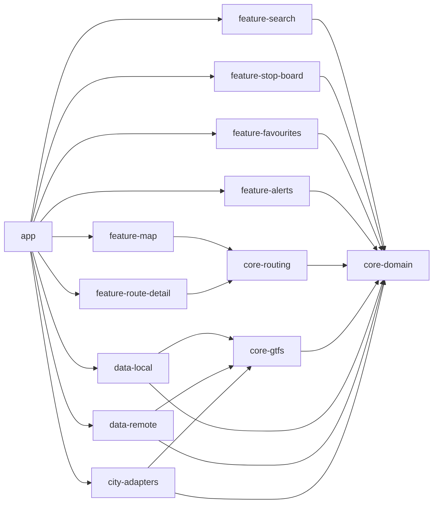

# CODEBASE_IMPACT_MAP

This map reflects the post-PASS-08 baseline and expected impact zones.

## Module Inventory

- `app`
- `core-domain`
- `core-gtfs`
- `core-routing`
- `data-local`
- `data-remote`
- `feature-map`
- `feature-search`
- `feature-stop-board`
- `feature-route-detail`
- `feature-favourites`
- `feature-alerts`
- `city-adapters`

## Module Responsibility and Status

| Module | Responsibility | Status after PASS 08 | Primary Risk if Changed |
| --- | --- | --- | --- |
| `app` | Android shell and composition root | Skeleton only | App wiring regressions |
| `core-domain` | Canonical IDs/models/invariants and calendar resolver | Implemented + tested | Semantic breakage system-wide |
| `core-gtfs` | Minimal fixture CSV parse and domain mapping | Implemented + tested | Silent ingest corruption |
| `core-routing` | Minimal direct-route search core | Implemented + tested | Wrong candidate guidance |
| `data-local` | Room schema/persistence surfaces | Skeleton/future | Migration/data loss |
| `data-remote` | Feed sync/download orchestration surfaces | Skeleton/future | Stale or invalid sync flow |
| `feature-map` | Map input aid UI | Skeleton/future | Destination input friction |
| `feature-search` | Destination search UI | Skeleton/future | Discovery failure |
| `feature-stop-board` | Stop departures UI | Skeleton/future | Departure trust loss |
| `feature-route-detail` | Rider route detail UI | Skeleton/future | Misleading instructions |
| `feature-favourites` | Saved places/routes UI | Skeleton/future | Preference loss |
| `feature-alerts` | Service alert UI | Skeleton/future | Missed disruptions |
| `city-adapters` | City-specific source mapping and normalization contract | Metadata next, runtime future | City rollout breakage |

## Dependency Direction Rules

- `core-routing` -> `core-domain`.
- `core-gtfs` -> `core-domain`.
- `city-adapters` -> `core-domain`, `core-gtfs`.
- `data-local` -> `core-domain`, `core-gtfs`.
- `data-remote` -> `core-domain`, `core-gtfs`.
- `feature-map` -> `core-routing`.
- `feature-search` -> `core-domain`.
- `feature-stop-board` -> `core-domain`.
- `feature-route-detail` -> `core-routing`.
- `feature-favourites` -> `core-domain`.
- `feature-alerts` -> `core-domain`.
- `app` orchestrates feature/data/city-adapter modules.

Forbidden direct coupling:
- `data-remote` must not depend on `city-adapters`.
- `city-adapters` must not depend on `data-remote`.
- Feature modules must not parse GTFS directly.

## Pass Type Matrix

| Pass Type | Read | Touch | Never touch | Validate |
| --- | --- | --- | --- | --- |
| `docs` | `README.md`, `AGENTS.md`, `docs/*` | `docs/*` | runtime/build/source modules | doc-targeted diff + `git diff --check` |
| `core-domain` | truth/protected/routing/testing docs | `core-domain`, tests, audit/state docs | Android/UI/data/city runtime | `:core-domain:test`, `:core-domain:build` |
| `core-gtfs` | data sources/pipeline/testing docs | `core-gtfs`, fixtures, audit/state docs | UI/routing search/Room/city runtime | `:core-gtfs:test`, `:core-gtfs:build` |
| `core-routing` | routing/truth/testing docs | `core-routing`, tests, audit/state docs | UI/Room/network/city runtime | `:core-routing:test`, `:core-routing:build` |
| `city-adapter` | city-adapters/data-sources docs | `city-adapters` and mapping metadata surfaces | parser/routing core internals unless scoped | adapter conformance checks |
| `room-schema` | architecture/protected/docs | `data-local` schema/migrations | parser/routing/ui runtime | migration and integrity checks |
| `compose-ui` | UX/architecture/routing docs | `app`, `feature-*` | core semantic rewrites | UI tests and manual flow checks |

## Mermaid Module Impact Overview

