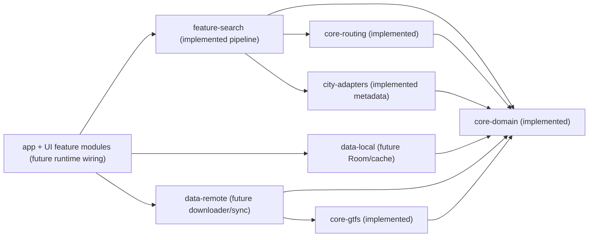

# CODEBASE_IMPACT_MAP

State synchronized after `PASS 27` Hilt DI baseline candidate.

## Module Responsibilities

| Module | Responsibility | Current status |
| --- | --- | --- |
| `core-domain` | Canonical IDs/models/invariants/calendar semantics | Implemented + tested |
| `core-gtfs` | GTFS parser/mapper and fixture parsing tests | Implemented + tested |
| `core-routing` | Direct-route search core | Implemented + tested |
| `city-adapters` | City metadata contract + Rakvere metadata | Implemented + tested |
| `feature-search` | Search pipeline: resolution, enrichment, orchestration, route-query preparation | Implemented + tested |
| `data-local` | Scoped Room feed snapshot persistence/import/provider baseline | Implemented baseline |
| `data-remote` | Future downloader/update-check boundary | Future |
| `app` + UI `feature-*` modules | Bundled bootstrap wiring + DI/runtime orchestration + UI flows | App bootstrap + Hilt DI baseline implemented; UI flows future |

## PASS 20 Impact

- `feature-search` gained test-scope integration with `core-gtfs` for fixture pipeline proof.
- No production parser integration was introduced.
- No Room/cache/downloader runtime boundary was introduced.

## PASS 22A Impact

- Architecture decision recorded: GTFS-derived local IDs are feed/city-scoped for storage identity.
- Composite Room-key strategy is now explicit for the next storage pass.
- No Room code was added in PASS 22A.

## PASS 22B Impact

- `DomainFeedSnapshot` and `DomainFeedSnapshotProvider` moved from `feature-search` to `core-domain`.
- `data-local` gained scoped-key Room baseline:
  - entities (`StopPointEntity`, `RoutePatternEntity`, `PatternStopEntity`)
  - DAO (`FeedSnapshotDao`)
  - DB (`AppDatabase`)
  - mapper (`FeedEntityMapper`)
  - load-then-serve provider (`RoomDomainFeedSnapshotLoader`, `RoomDomainFeedSnapshotProvider`)
- No parser/routing/search algorithm behavior changed.

## PASS 23 Impact

- `data-local` gained production write path:
  - `FeedSnapshotImporter` writes `DomainFeedSnapshot` into scoped Room tables via DAO transaction replace.
- `data-local` gained parser-fixture integration coverage in tests:
  - parser/mapper (test scope) -> `DomainFeedSnapshot` -> Room importer -> Room provider -> search query preparation.
- CI now runs explicit `./gradlew test` step in addition to build/lint.

## PASS 24 Impact (Docs-Only Decision)

- MVP bootstrap source decision recorded:
  - bundled APK asset first
  - downloader/WorkManager refresh later
- Runtime lifecycle responsibilities are now explicit:
  - app-layer future bootstrap owner reads bundled asset
  - app-layer future bootstrap owner calls importer
  - search bootstrap owner prepares provider before search
- No source/build/schema/runtime behavior changes were introduced in PASS 24.

## PASS 25 Impact

- `app` gained bundled bootstrap baseline implementation:
  - synthetic bundled JSON asset
  - bootstrap DTOs and domain mapping
  - `FeedBootstrapLoader` (`import` + `prepare`) with safe missing-asset handling
  - pre-Hilt `AndrobussApplication` startup wiring
- `data-local` gained temporary `AppDatabase.create(context)` factory for pre-Hilt bootstrap.
- `app` gained Robolectric bootstrap tests covering import/prepare success, idempotency, and anti-fabrication.
- No parser invocation was added in app production code.
- No UI/ViewModel/Hilt/WorkManager/downloader/realtime behavior was added.

## PASS 27 Impact

- `app` gained Hilt DI baseline wiring:
  - `@HiltAndroidApp` on `AndrobussApplication`
  - app-owned DI modules provide:
    - `AppDatabase`
    - `FeedSnapshotDao`
    - `FeedSnapshotImporter`
    - `RoomDomainFeedSnapshotLoader`
    - `RoomDomainFeedSnapshotProvider`
    - `FeedBootstrapLoader`
- Manual object graph construction was removed from `AndrobussApplication`.
- `FeedBootstrapLoader` logic, synthetic runtime asset default, and Room schema remain unchanged.
- Core modules (`core-domain`, `core-gtfs`, `core-routing`) remain Hilt-free.

## Governance Docs-Only Impact (PASS G03)

- `docs/AUDIT_INDEX.md` and read-order sync changes are governance/docs only.
- Audit-index updates do not change runtime behavior, dependency direction, or module contracts.
- Memory hygiene passes must not modify runtime modules (`app`, `core-*`, `data-*`, `feature-*`).

## Build Tooling Impact (PASS_AUTO_02)

- Root Gradle build enables dependency locking for all projects/configurations.
- Each module now has a tracked `gradle.lockfile` for resolved dependency versions.
- `settings-gradle.lockfile` tracks settings/buildscript resolution.
- This pass hardens dependency reproducibility and transitive drift visibility only; runtime behavior is unchanged.

## Feature-Search Snapshot

- Destination resolver implemented.
- Place-to-stop candidate mapping implemented.
- Stop-point resolution contract and in-memory index implemented.
- Stop-candidate enrichment implemented.
- Destination enrichment orchestrator implemented.
- Direct-route query preparation use-case implemented.
- Parser-derived integration proven in tests only (`rakvere-smoke`).
- No app/ViewModel runtime wiring yet.
- App pre-Hilt bootstrap runtime wiring exists via `AndrobussApplication`.
- Feed contract move to `core-domain` and Room baseline are now implemented.
- Feature-search remains consumer of prepared `DomainFeedSnapshot`; it does not bootstrap/import feed data.

## Dependency Direction Rules

Production dependencies:
- `core-routing` -> `core-domain`
- `core-gtfs` -> `core-domain`
- `city-adapters` -> `core-domain`
- `feature-search` -> `core-domain`, `core-routing`, `city-adapters`
- `data-local` -> `core-domain`
- `data-remote` -> `core-domain`, `core-gtfs` (future)
- `app` orchestrates `feature-*`, `data-*`, and `city-adapters`

Test-only dependency:
- `feature-search` tests may depend on `core-gtfs`
- `data-local` tests may depend on `core-gtfs` and `feature-search` for importer/provider integration coverage

Runtime responsibility note:
- `data-local` owns Room import/read baseline and does not read bundled assets.
- `data-local` production code does not parse GTFS directly.
- `app` now owns bundled-asset bootstrap import orchestration through Hilt baseline wiring.
- `app` UI/ViewModel consumption of prepared snapshot remains future work.

Forbidden directions:
- Core modules must not depend on feature modules.
- `feature-search` production must not depend on `core-gtfs` parser implementation.

## Module State Diagram

