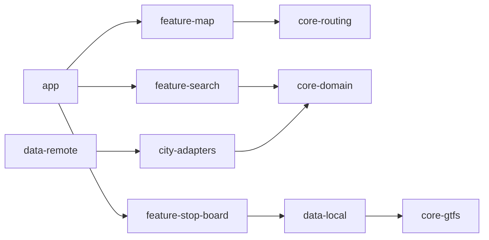

# CODEBASE_IMPACT_MAP

This map defines expected module boundaries and likely change impact zones before implementation starts.

## Planned Modules

- `app`
- `core-domain`
- `core-gtfs`
- `core-routing`
- `data-local`
- `data-remote`
- `feature-map`
- `feature-search`
- `feature-stop-board`
- `city-adapters`

## Impact Expectations

- Domain model changes will ripple through routing, adapters, and UI features.
- GTFS parser and calendar logic changes are high regression risk.
- Adapter contract changes can break city-specific ingest and realtime logic.

## Mermaid Placeholder

