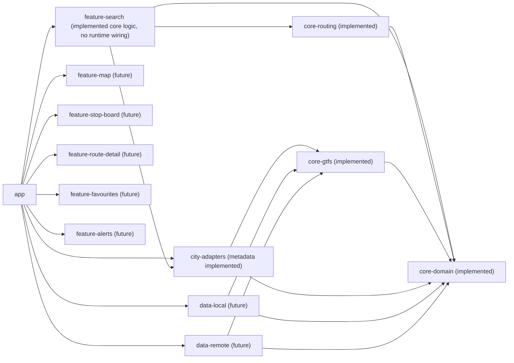

# CODEBASE_IMPACT_MAP

This map reflects the post-PASS-16 implementation state.

## Module Inventory

- `app`
- `core-domain`
- `core-gtfs`
- `core-routing`
- `data-local`
- `data-remote`
- `feature-map`
- `feature-search`
- `feature-stop-board`
- `feature-route-detail`
- `feature-favourites`
- `feature-alerts`
- `city-adapters`

## Module Responsibility and Status

| Module | Responsibility | Status after PASS 16 | Primary Risk if Changed |
| --- | --- | --- | --- |
| `app` | Android shell and composition root | Skeleton only | Broken runtime wiring |
| `core-domain` | Canonical IDs/models/invariants and calendar resolver | Implemented + tested | Semantic breakage across modules |
| `core-gtfs` | Minimal fixture parser and domain mapper | Implemented + tested | Silent ingest corruption |
| `core-routing` | Direct-route search core | Implemented + tested | Wrong direct-route outcomes |
| `city-adapters` | City metadata contract and Rakvere metadata | Implemented metadata + tested | City mapping regressions |
| `feature-search` | Destination/origin candidates, bridge, stop-point resolution, stop-candidate enrichment | Implemented + tested (no app wiring yet) | Candidate/resolution contract drift |
| `data-local` | Room schema/persistence surfaces | Skeleton/future | Migration/data loss |
| `data-remote` | Feed sync/download orchestration surfaces | Skeleton/future | Stale or invalid data pipeline |
| `feature-map` | Map input aid UI | Skeleton/future | Map-first UX drift |
| `feature-stop-board` | Stop departures UI | Skeleton/future | Departure trust loss |
| `feature-route-detail` | Rider route detail UI | Skeleton/future | Misleading rider instructions |
| `feature-favourites` | Saved places/routes UI | Skeleton/future | Preference loss |
| `feature-alerts` | Service alert UI | Skeleton/future | Missed disruptions |

## Feature-Search Capability Snapshot

- Destination query normalization and alias resolution is implemented.
- Destination place-to-stop candidate mapping is implemented at unresolved name level.
- Origin candidate resolver is implemented for manual text and current-location seeds (unresolved).
- Direct route bridge precondition gating is implemented.
- Stop-point resolution contract and in-memory name index are implemented.
- Stop-candidate enrichment is implemented (`StopCandidateEnricher` + result model).
- PASS 15 integration tests prove resolution + bridge flow with hand-built domain data.
- No app/ViewModel/runtime wiring exists yet.
- No Room/cache/network/nearest-stop runtime implementation exists.

## Dependency Direction Rules

- `core-routing` -> `core-domain`
- `core-gtfs` -> `core-domain`
- `city-adapters` -> `core-domain`, `core-gtfs`
- `feature-search` -> `core-domain`, `city-adapters`, `core-routing`
- `data-local` -> `core-domain`, `core-gtfs`
- `data-remote` -> `core-domain`, `core-gtfs`
- `app` orchestrates `feature-*`, `data-*`, and `city-adapters`

Forbidden direct coupling:

- `data-remote` must not depend on `city-adapters`
- `city-adapters` must not depend on `data-remote`
- feature modules must not parse GTFS directly

## Mermaid Module Impact Overview

