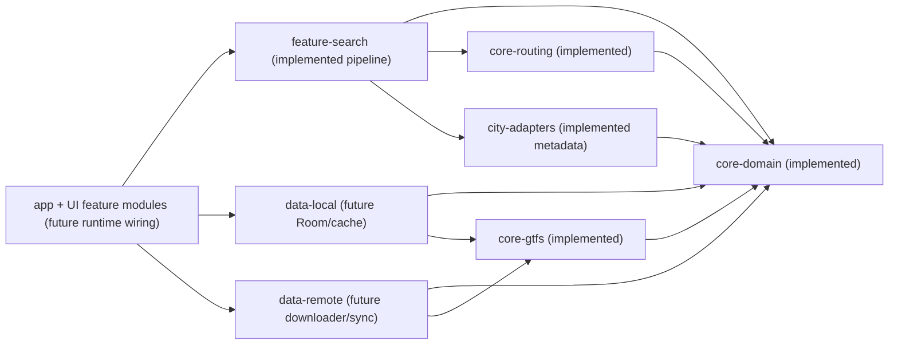

# CODEBASE_IMPACT_MAP

State synchronized after `PASS 22A`.

## Module Responsibilities

| Module | Responsibility | Current status |
| --- | --- | --- |
| `core-domain` | Canonical IDs/models/invariants/calendar semantics | Implemented + tested |
| `core-gtfs` | GTFS parser/mapper and fixture parsing tests | Implemented + tested |
| `core-routing` | Direct-route search core | Implemented + tested |
| `city-adapters` | City metadata contract + Rakvere metadata | Implemented + tested |
| `feature-search` | Search pipeline: resolution, enrichment, orchestration, route-query preparation | Implemented + tested |
| `data-local` | Future Room/cache/feed persistence boundary | Future |
| `data-remote` | Future downloader/update-check boundary | Future |
| `app` + UI `feature-*` modules | Runtime wiring + UI flows | Skeleton/future |

## PASS 20 Impact

- `feature-search` gained test-scope integration with `core-gtfs` for fixture pipeline proof.
- No production parser integration was introduced.
- No Room/cache/downloader runtime boundary was introduced.

## PASS 22A Impact

- Architecture decision recorded: GTFS-derived local IDs are feed/city-scoped for storage identity.
- Composite Room-key strategy is now explicit for the next storage pass.
- No Room code was added in PASS 22A.

## Feature-Search Snapshot

- Destination resolver implemented.
- Place-to-stop candidate mapping implemented.
- Stop-point resolution contract and in-memory index implemented.
- Stop-candidate enrichment implemented.
- Destination enrichment orchestrator implemented.
- Direct-route query preparation use-case implemented.
- Parser-derived integration proven in tests only (`rakvere-smoke`).
- No app/ViewModel runtime wiring yet.
- Feed contract move to `core-domain` and Room baseline are pending next pass.

## Dependency Direction Rules

Production dependencies:
- `core-routing` -> `core-domain`
- `core-gtfs` -> `core-domain`
- `city-adapters` -> `core-domain`
- `feature-search` -> `core-domain`, `core-routing`, `city-adapters`
- `data-local` -> `core-domain`, `core-gtfs` (future)
- `data-remote` -> `core-domain`, `core-gtfs` (future)
- `app` orchestrates `feature-*`, `data-*`, and `city-adapters`

Test-only dependency:
- `feature-search` tests may depend on `core-gtfs`

Forbidden directions:
- Core modules must not depend on feature modules.
- `feature-search` production must not depend on `core-gtfs` parser implementation.

## Module State Diagram

