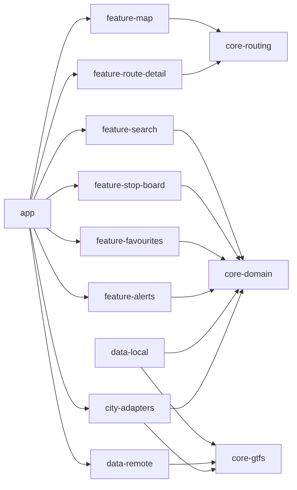

# CODEBASE_IMPACT_MAP

This map defines expected module boundaries and likely change impact zones before implementation starts.

## Planned Modules

- `app`
- `core-domain`
- `core-gtfs`
- `core-routing`
- `data-local`
- `data-remote`
- `feature-map`
- `feature-search`
- `feature-stop-board`
- `feature-route-detail`
- `feature-favourites`
- `feature-alerts`
- `city-adapters`

## Impact Expectations

- Domain model changes will ripple through routing, adapters, and UI features.
- GTFS parser and calendar logic changes are high regression risk.
- Adapter contract changes can break city-specific ingest and realtime logic.

## Orchestration Clarification

- `data-remote` and `city-adapters` are orchestrated by app/sync composition layers.
- `data-remote` must not directly depend on `city-adapters`.
- `city-adapters` must not directly depend on `data-remote`.

## Module Responsibility Table

| Module | Responsibility | Primary Risk if Changed |
| --- | --- | --- |
| `app` | App shell, navigation, DI assembly | Startup/navigation regressions |
| `core-domain` | Canonical model and invariants (`Stop` vs `StopPoint`) | System-wide semantic breakage |
| `core-gtfs` | GTFS parse/map/normalize | Silent data corruption |
| `core-routing` | Route candidate interface and ranking | Wrong rider guidance |
| `data-local` | Room schema, DAO, offline cache | Migration/data-loss risk |
| `data-remote` | Feed fetch/validate/sync orchestration | Stale or invalid sync state |
| `feature-map` | Destination assist map UI | Input friction and UX confusion |
| `feature-search` | Destination-first search UI | Candidate discovery failure |
| `feature-stop-board` | Stop departures board UI | Departure trust issues |
| `feature-route-detail` | Route detail/rider instruction UI | Misleading trip instructions |
| `feature-favourites` | Saved items/preferences UI | User preference loss |
| `feature-alerts` | Service alert presentation | Missed critical disruptions |
| `city-adapters` | City-specific mapping/contracts | City rollout breakage |

## Pass Type Matrix

| Pass Type | Read | Touch | Never touch | Validate |
| --- | --- | --- | --- | --- |
| `docs` | `README.md`, `AGENTS.md`, `docs/*` | `docs/*` | `app/`, `core-*`, `data-*`, `feature-*`, build files | `git diff --name-only` only docs paths |
| `android-skeleton` | architecture + roadmap docs | module folders + build config skeleton only | domain logic, parser internals | gradle sync, module graph sanity |
| `core-domain` | truth/protected/architecture docs | `core-domain` + relevant tests/docs | UI/features/adapters direct edits | model invariants + test suite |
| `core-gtfs` | architecture + data source docs | `core-gtfs` + parsing tests/docs | feature modules, UI, city-specific UI logic | parser fixtures + normalization checks |
| `core-routing` | routing + truth/protected docs | `core-routing` + tests/docs | direct UI edits, Room migrations | route correctness tests |
| `room-schema` | architecture + protected surfaces | `data-local` schema/migrations/docs | feature UI and routing internals | migration tests + data integrity |
| `city-adapter` | city adapters + truth index + data source docs | `city-adapters` (+ integration seams/docs) | core invariants without approved pass | adapter conformance + city checks |
| `compose-ui` | UX principles + architecture docs | `feature-*`, `app` UI wiring, UI docs | GTFS parsing internals | UI tests, manual flow checks |
| `sync/workmanager` | GTFS pipeline + architecture docs | `data-remote`, scheduler wiring, docs | protected core model changes | sync scheduling + offline behavior tests |
| `deployment` | deployment + roadmap + testing docs | release config/docs/process files | core business logic rewrites | release checklist + staged rollout gates |

## Mermaid Module Impact Overview

