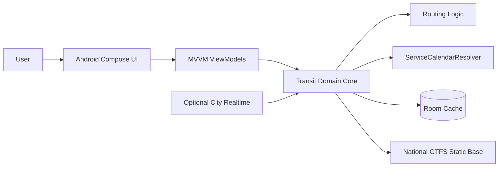
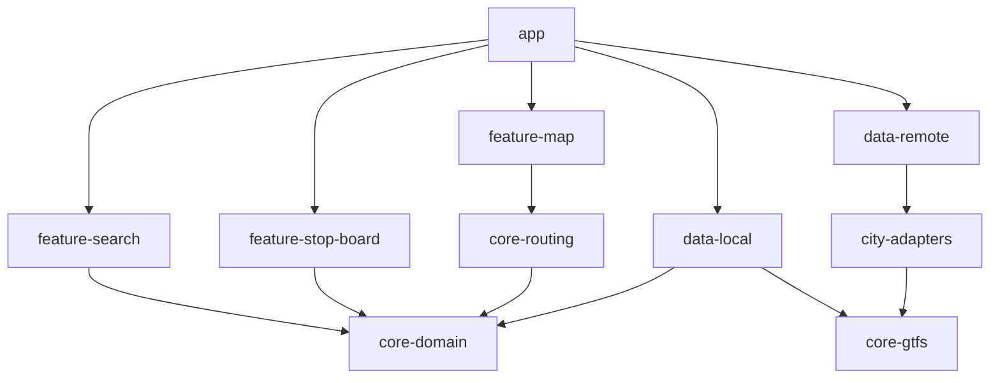
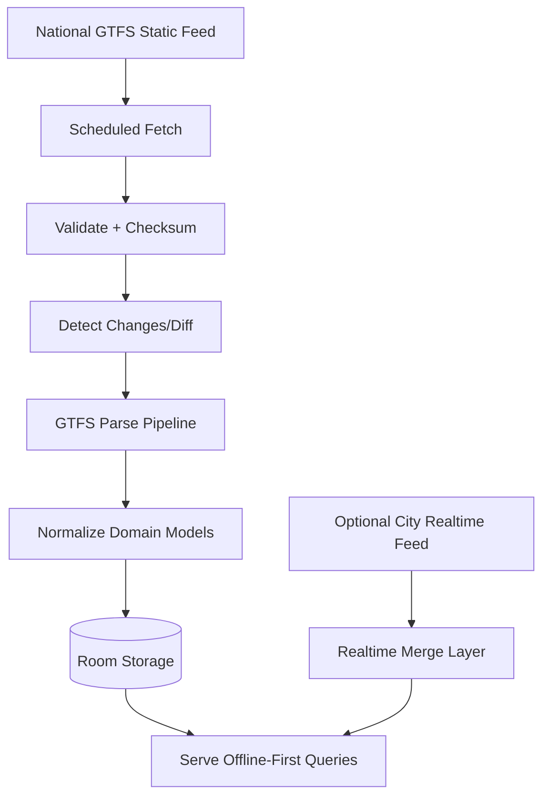
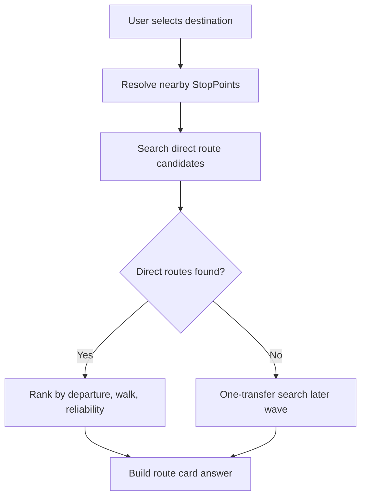
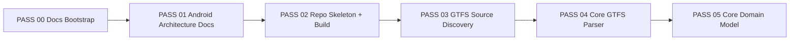

# MERMAID_DIAGRAMS

## High-Level Architecture

```mermaid
flowchart LR
    User --> UI[Android Compose UI]
    UI --> VM[MVVM ViewModels]
    VM --> Domain[Transit Domain Core]
    Domain --> Routing[Routing Logic]
    Domain --> Calendar[ServiceCalendarResolver]
    Domain --> Local[(Room Cache)]
    Domain --> GTFS[National GTFS Static Base]
    Realtime[Optional City Realtime] --> Domain
```

## Android Module Dependency Graph

```mermaid
graph TD
    app --> feature_map[feature-map]
    app --> feature_search[feature-search]
    app --> feature_stop_board[feature-stop-board]
    feature_map --> core_routing[core-routing]
    feature_search --> core_domain[core-domain]
    feature_stop_board --> core_domain
    core_routing --> core_domain
    data_local[data-local] --> core_gtfs[core-gtfs]
    data_local --> core_domain
    data_remote[data-remote] --> city_adapters[city-adapters]
    city_adapters --> core_gtfs
    app --> data_local
    app --> data_remote
```

## GTFS/Data Ingestion Flow

```mermaid
flowchart TD
    Source[National GTFS Static Feed] --> Fetch[Scheduled Fetch]
    Fetch --> Validate[Validate + Checksum]
    Validate --> Diff[Detect Changes/Diff]
    Diff --> Parse[GTFS Parse Pipeline]
    Parse --> Normalize[Normalize Domain Models]
    Normalize --> Store[(Room Storage)]
    Store --> Serve[Serve Offline-First Queries]
    CityRT[Optional City Realtime Feed] --> Merge[Realtime Merge Layer]
    Merge --> Serve
```

## Route Candidate Search Flow

```mermaid
flowchart TD
    Start[User selects destination] --> Nearby[Resolve nearby StopPoints]
    Nearby --> Direct[Search direct route candidates]
    Direct --> HasDirect{Direct routes found?}
    HasDirect -->|Yes| Rank[Rank by departure, walk, reliability]
    HasDirect -->|No| Transfer[One-transfer search later wave]
    Rank --> Card[Build route card answer]
    Transfer --> Card
```

## Pass Workflow

```mermaid
flowchart LR
    P0[PASS 00 Docs Bootstrap] --> P1[PASS 01 Android Architecture Docs]
    P1 --> P2[PASS 02 Repo Skeleton + Build]
    P2 --> P3[PASS 03 GTFS Source Discovery]
    P3 --> P4[PASS 04 Core GTFS Parser]
    P4 --> P5[PASS 05 Core Domain Model]
```
