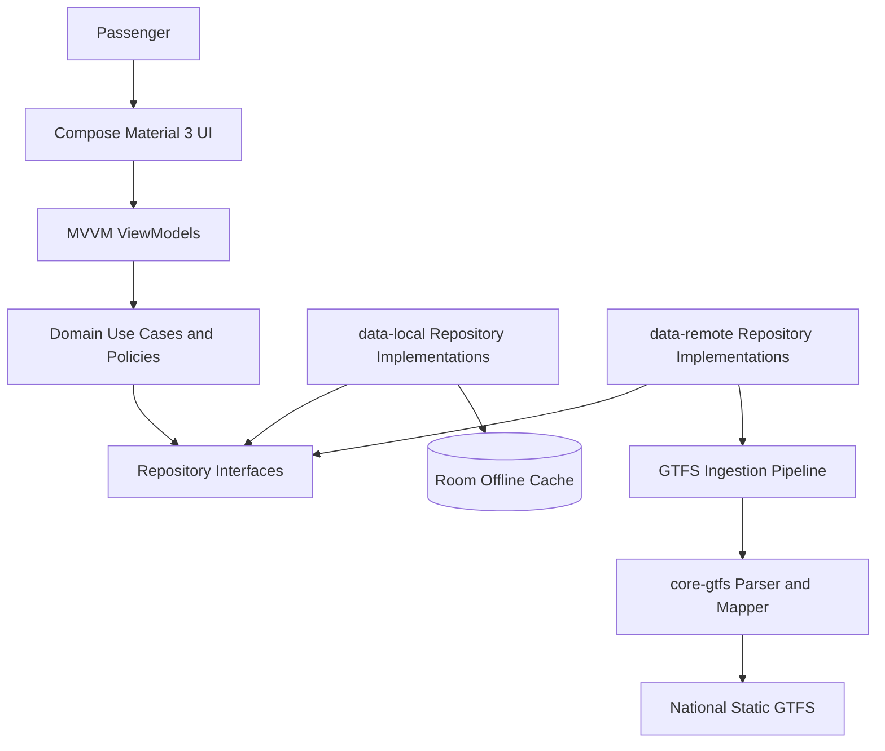
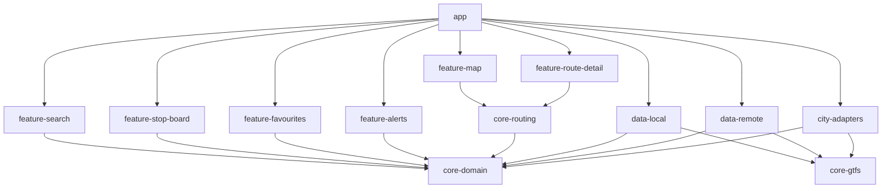
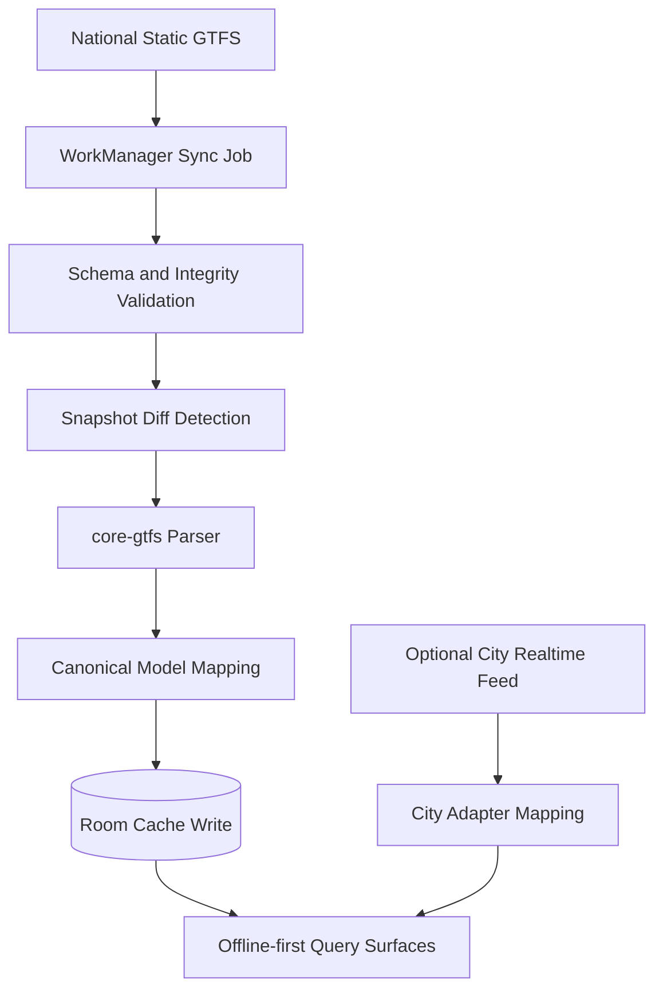
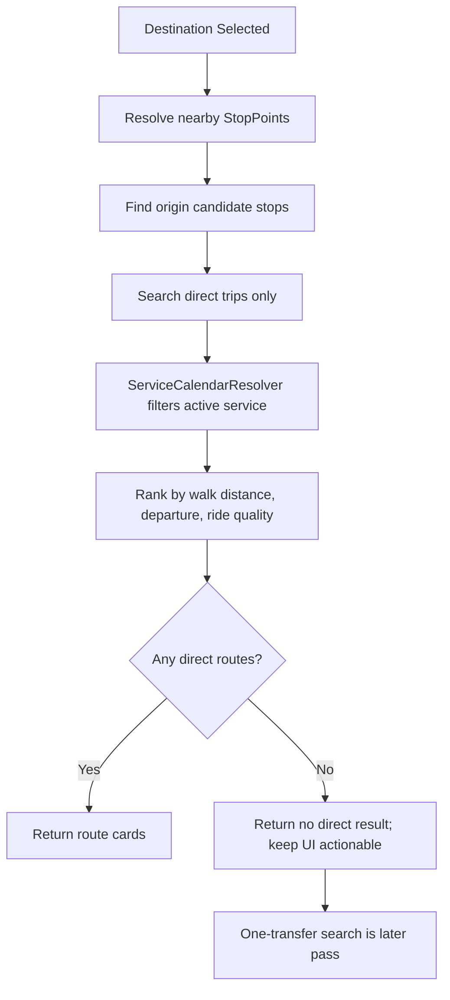
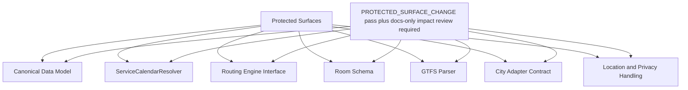

# MERMAID_DIAGRAMS

Mermaid diagrams in this file are the source of truth for architecture visuals in PASS 01 and PASS 01B.

## High-Level System Architecture

## Android Module Dependency Graph

## GTFS Ingestion Flow

## Direct Route Candidate Search Flow

## Pass Workflow

```mermaid
flowchart LR
    P00[PASS 00 Repo Bootstrap Docs done] --> P01[PASS 01 Android App Architecture Docs done]
    P01 --> P01B[PASS 01B Architecture Review Fixes current]
    P01B --> P02[PASS 02 Repo Skeleton and Build]
    P02 --> P03[PASS 03 GTFS Source Discovery]
    P03 --> P04[PASS 04 Core GTFS Parser]
    P04 --> P05[PASS 05 Core Domain Model]
    P05 --> P06[PASS 06 Calendar Resolver]
    P06 --> P07[PASS 07 Room Schema]
    P07 --> P08[PASS 08 Rakvere Adapter and GTFS Ingest]
    P08 --> P09[PASS 09 Direct Route Engine]
    P09 --> P10[PASS 10 Android Compose Skeleton with Stop Board]
```

## Protected Surfaces Diagram

