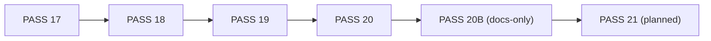
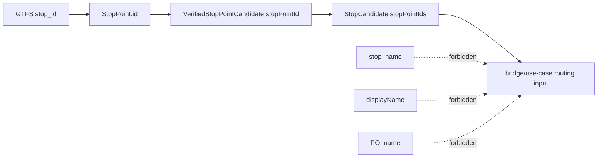
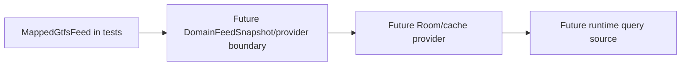
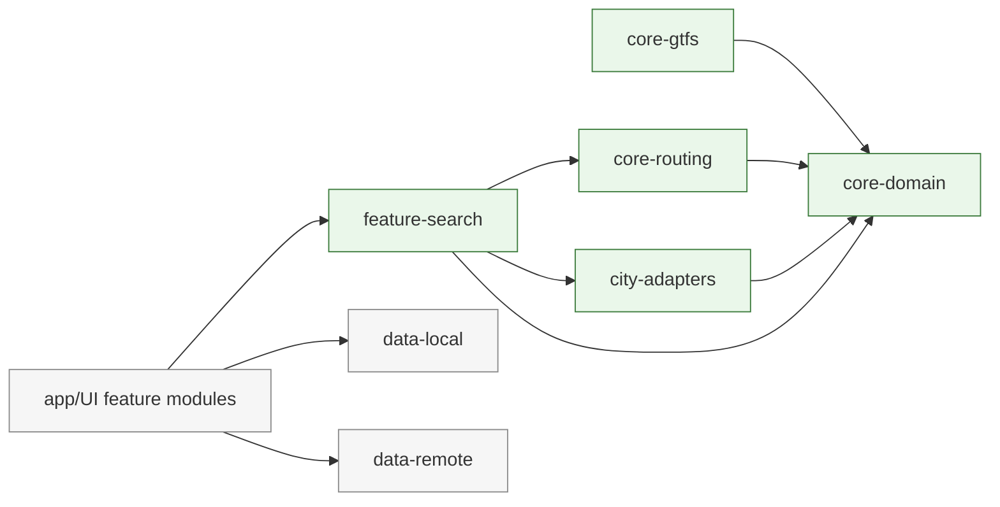

# MERMAID_DIAGRAMS

Synchronized after `PASS 20B`.

## Pass Timeline (Latest)

## PASS 20 Fixture-to-Search Pipeline

```mermaid
flowchart LR
    Fixture["rakvere-smoke fixture"] --> Parser["GtfsFeedParser"]
    Parser --> Mapper["GtfsDomainMapper"]
    Mapper --> Feed["MappedGtfsFeed"]
    Feed --> StopPoints["stopPoints"]
    Feed --> Patterns["routePatterns"]
    StopPoints --> Index["InMemoryStopPointIndex"]
    Index --> Enricher["StopCandidateEnricher"]
    Enricher --> Orchestrator["DestinationEnrichmentOrchestrator"]
    Patterns --> UseCase["DirectRouteQueryPreparationUseCase"]
    Orchestrator --> UseCase
    UseCase --> Bridge["DirectRouteQueryBridge"]
    Bridge --> Search["DirectRouteSearch"]
```

## StopPointId Source Safety

## Provider Boundary (Future)

## Implemented Modules After PASS 20

