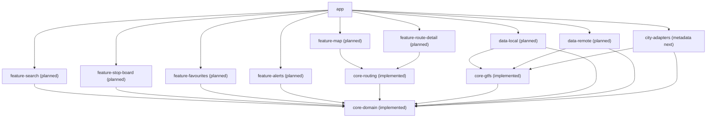
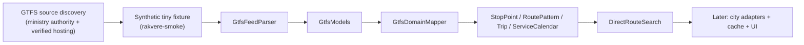
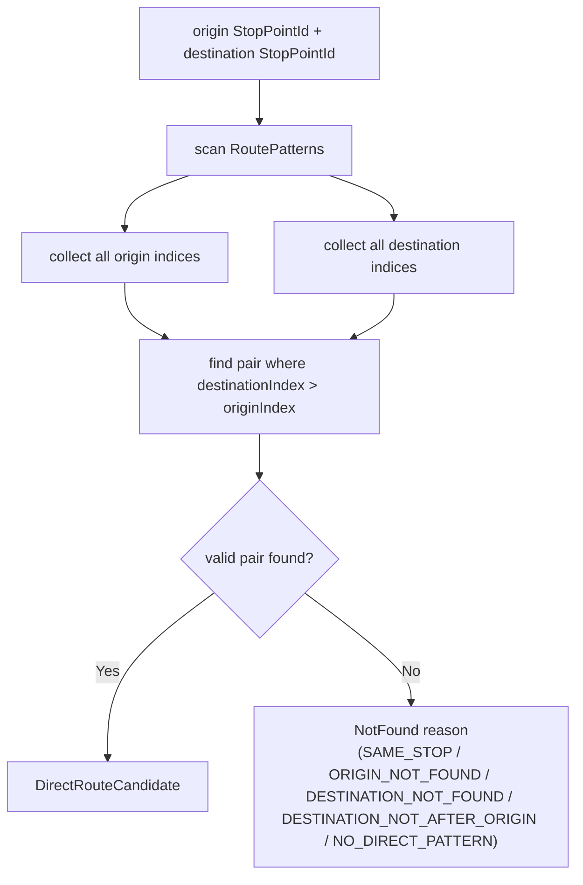
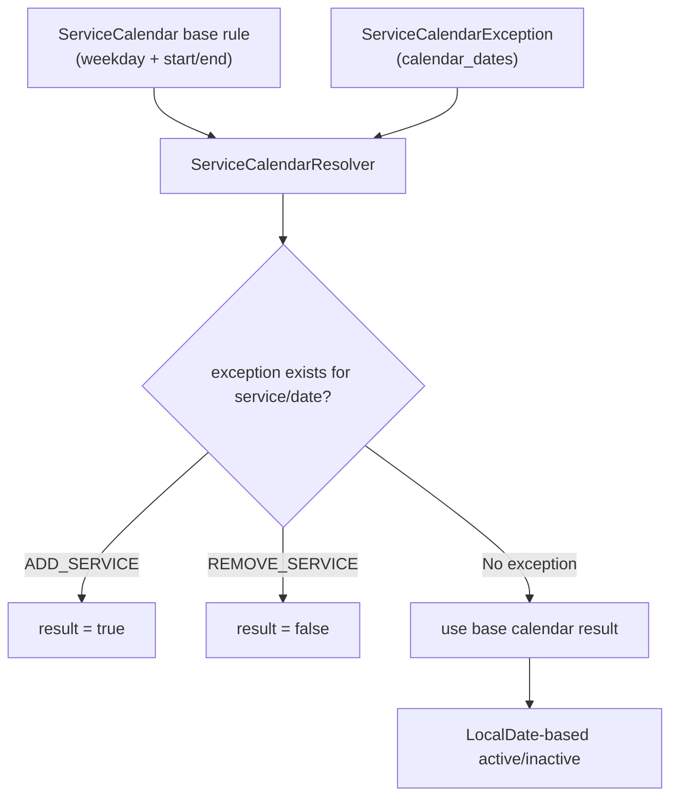
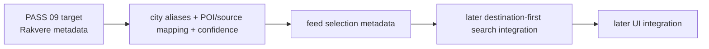

# MERMAID_DIAGRAMS

Mermaid diagrams in this file are the source of truth for architecture visuals after PASS UX-01.

## Pass Timeline

```mermaid
flowchart LR
    P00["PASS 00\ndocs bootstrap"] --> P01B["PASS 01B\narchitecture review fixes"]
    P01B --> P02["PASS 02\nrepo skeleton + build"]
    P02 --> P03["PASS 03\nGTFS source discovery"]
    P03 --> P04["PASS 04\nfixture strategy + city mapping"]
    P04 --> P05["PASS 05\ncore-domain stop/pattern models"]
    P05 --> P05B["PASS 05B\nnamespace + guardrails"]
    P05B --> P06["PASS 06\ncalendar resolver + tests"]
    P06 --> P07["PASS 07\nminimal GTFS fixture parser"]
    P07 --> P08["PASS 08\ndirect route search core"]
    P08 --> P09["PASS 09\nRakvere city adapter metadata"]
    P09 --> P10["PASS 10\ndestination target resolver"]
    P10 --> P11["PASS 11\nplace-to-stop candidate mapping"]
    P11 --> P12["PASS 12\norigin candidate resolver"]
    P12 --> P13["PASS 13\ndirect-route bridge + preconditions"]
    P13 --> P14["PASS 14\nstop-point resolution contract + name index"]
    P14 --> P15["PASS 15\nresolution-bridge integration tests"]
    P15 --> PUX01["PASS UX-01\ndocs-only UX blueprint sync"]
    PUX01 --> P16["PASS 16 planned\nproduction enrichment + bridge wiring"]
```

## Android Module Dependency Graph

## GTFS Data Pipeline Baseline

## Direct Route Algorithm

## Calendar Resolver Semantics

## Future City Adapter Path (Metadata First)

## UX Flow (Destination-First MVP)

```mermaid
flowchart LR
    Open["First open"] --> Ask["Kuhu soovid minna?"]
    Ask --> Input["Quick destination buttons or search"]
    Input --> Origin["Origin seed (manual text or location seed)"]
    Origin --> Candidates["Route candidate query path"]
    Candidates --> Cards["1-3 result cards with large ETA"]
    Cards --> Detail["Route detail (progressive disclosure)"]
    Detail --> Map["Optional map helper view"]
```

